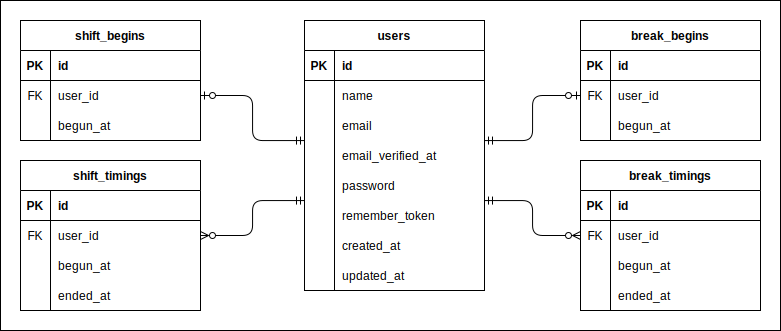

# 勤怠管理システム

## 作成した目的

## アプリケーションURL

## 他のリポジトリ

## 機能一覧

## 使用技術(実行環境)

## テーブル設計

[テーブル仕様書](doc/テーブル仕様書.md)

## ER図

## 環境構築

## 設計中の副産物

- [ユースケース図](doc/ユースケース図.md)
- [行動シナリオ](doc/行動シナリオ.md)
- [画面遷移図](doc/画面遷移図.md)
- [ワークセット](doc/ワークセット.md)
- [CRUD表](doc/CRUD表.md)
- [シーケンス図](doc/シーケンス図.md)
- [ブラウザテスト設計書](https://docs.google.com/spreadsheets/d/e/2PACX-1vTixRKMpxxeyUV5OY40ovLoEz3l2noCiVuny9d4Y4zay0Kq7il-nNiU9A-bpV3x4mgP1nSSJTZJTOZC/pubhtml) (Google スプレッドシート)
- [機能テスト設計書](https://docs.google.com/spreadsheets/d/e/2PACX-1vQKNQA7mN3Yc2YL3RQYqoXgru-G919Zb2mwsKDbtWPsSJa4YKYr_PMtjUSEtFIMCvw3gJ1G8wIZL2pk/pubhtml) (Google スプレッドシート)
