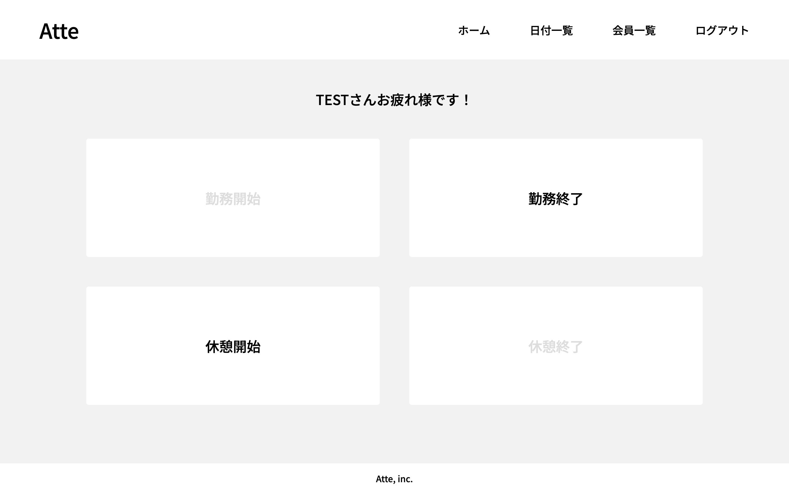

# 勤怠管理システム「Atte」

[](https://github.com/ryamao/atte/actions/workflows/laravel.yml)

「Atte」はWebベースの勤怠管理システムです。ユーザー登録を行い、個々のユーザーが勤務開始/終了時間と休憩開始/終了時間を記録できます。また、日付別に全ユーザーの勤怠情報を閲覧することが可能です。



## 作成した目的

このアプリはプログラミングスクールの模擬案件として開発されました。模擬案件はエンジニアとして必要な解決力を付けることを目的としています。要件定義書に基づいて「設計」「コーディング」「テスト」という実践に近い開発経験を積むことでスキルを向上させることが狙いです。

アプリ自体は、ある架空の企業の人事評価のために利用されるという想定で開発しました。

## アプリケーションURL

現在デプロイは完了していませんが、AWSを使用してのデプロイを予定しています。

## 機能一覧

- 認証機能
  - ユーザー登録
  - ログイン/ログアウト
  - メールでの本人確認
- 打刻機能
  - 勤務開始/終了の記録
  - 休憩開始/終了の記録
  - ボタン操作で現在日時を記録
- 日付別勤怠情報表示
  - 1日分の全ユーザー勤怠情報表示
  - ページネーション機能
  - 前日・翌日へのリンク
- ユーザー一覧機能
  - 全ユーザーの名前表示
  - 名前の部分一致検索
  - ページネーション機能
- ユーザー別勤怠情報表示
  - 1月分の個別ユーザー勤怠情報表示
  - ページネーション機能
  - 前月・翌月へのリンク

## 使用技術(実行環境)

- PHP 8.3
- Laravel Framework 10.42
- Laravel Fortify 1.20
- MySQL 8.0
- Docker（ローカル開発環境）

## テーブル設計

[テーブル仕様書](doc/テーブル仕様書.md)

## ER図


## 環境構築

- 環境構築の前提として Docker がシステムにインストールされている必要があります。
- 開発と動作確認は macOS 14 上で行いました。他の環境では動作確認していませんので、不具合があるかもしれませんがご了承ください。

1. プロジェクトのリポジトリをクローンします。

```shell-session
git clone <https://github.com/ryamao/atte>
```

2. クローンしたリポジトリのディレクトリに移動します。

```shell-session
cd atte
```

3. `.env.example` ファイルをコピーして `.env` ファイルを作成します。

```shell-session
cp .env.example .env
```

4. `.env` ファイル内の `DB_HOST` の値を `mysql` に設定します。これはDocker内のMySQLサービスに接続するための設定です。

```shell-session
sed -i '' 's/^DB_HOST=.*$/DB_HOST=mysql/' .env
```

5. Composerを使ってプロジェクトの依存関係をインストールします。

```shell-session
docker run --rm -it -v $PWD:/app composer install
```

6. Laravel Sailを使用して、Dockerコンテナをビルドし、デタッチドモードで起動します。

```shell-session
vendor/bin/sail up -d --build
```

7. アプリケーションキーを生成します。

```shell-session
vendor/bin/sail artisan key:generate
```

8. データベースのマイグレーションを実行し、初期データでデータベースをシードします。

```shell-session
vendor/bin/sail artisan migrate --seed
```

これでローカル環境で「Atte」を実行する準備が整いました。WebサーバーはTCPポート80でリッスンしているため、ブラウザから `http://localhost` にアクセスすることで、「Atte」を使用することができます。

## その他のドキュメント

- [ユースケース図](doc/ユースケース図.md)
- [行動シナリオ](doc/行動シナリオ.md)
- [画面遷移図](doc/画面遷移図.md)
- [ワークセット](doc/ワークセット.md)
- [CRUD表](doc/CRUD表.md)
- [シーケンス図](doc/シーケンス図.md)
