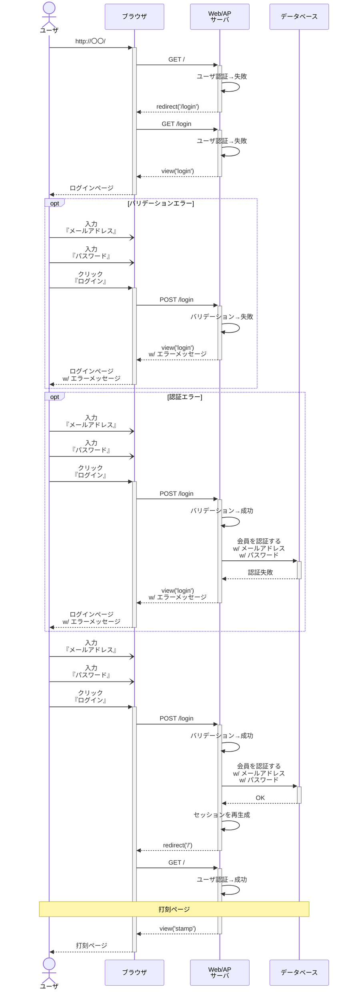

# ログイン

```mermaid
sequenceDiagram
  actor U as ユーザ
  participant B as ブラウザ
  participant A as Web/AP<br>サーバ
  participant D as データベース

  U ->>+ B : http://〇〇/
  B ->>+ A : GET /
  A ->> A : ユーザ認証→失敗
  A -->>- B : redirect('/login')
  B ->>+ A : GET /login
  A ->> A : ユーザ認証→失敗
  A -->>- B : view('login')
  B -->>- U : ログインページ

  opt バリデーションエラー
    U -) B : 入力<br>『メールアドレス』
    U -) B : 入力<br>『パスワード』
    U ->>+ B : クリック<br>『ログイン』
    B ->>+ A : POST /login
    A ->> A : バリデーション→失敗
    A -->>- B : view('login')<br>w/ エラーメッセージ
    B -->>- U : ログインページ<br>w/ エラーメッセージ
  end

  opt 認証エラー
    U -) B : 入力<br>『メールアドレス』
    U -) B : 入力<br>『パスワード』
    U ->>+ B : クリック<br>『ログイン』
    B ->>+ A : POST /login
    A ->> A : バリデーション→成功
    A ->>+ D : 会員を認証する<br>w/ メールアドレス<br>w/ パスワード
    D -->>- A : 認証失敗
    A -->>- B : view('login')<br>w/ エラーメッセージ
    B -->>- U : ログインページ<br>w/ エラーメッセージ
  end

  U -) B : 入力<br>『メールアドレス』
  U -) B : 入力<br>『パスワード』
  U ->>+ B : クリック<br>『ログイン』
  B ->>+ A : POST /login
  A ->> A : バリデーション→成功
  A ->>+ D : 会員を認証する<br>w/ メールアドレス<br>w/ パスワード
  D -->>- A : OK
  A ->> A : セッションを再生成
  A -->>- B : redirect('/')
  B ->>+ A : GET /
  A ->> A : ユーザ認証→成功
  note over U, D : 打刻ページ
  A -->>- B : view('stamp')
  B -->>- U : 打刻ページ
```
