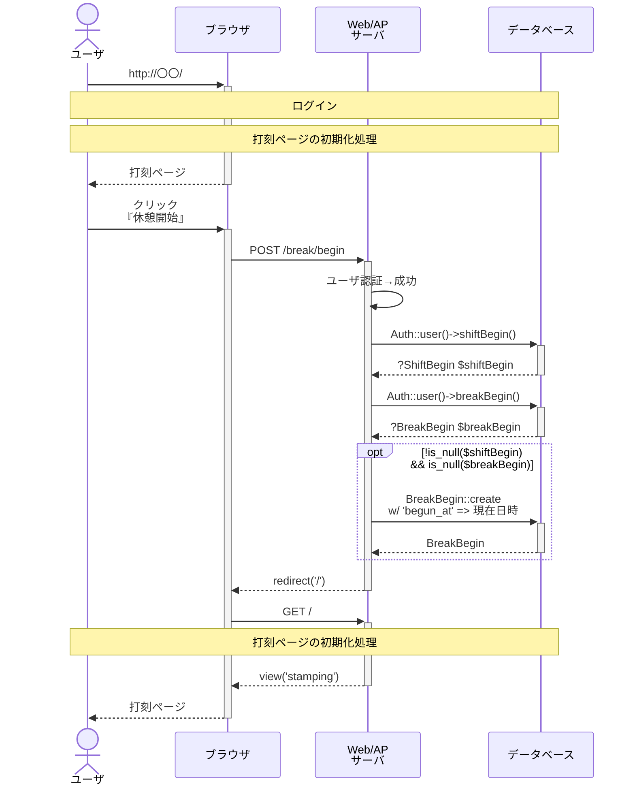

# 休憩開始

```mermaid
sequenceDiagram
  actor U as ユーザ
  participant B as ブラウザ
  participant A as Web/AP<br>サーバ
  participant D as データベース

  U ->>+ B : http://〇〇/
  note over U, D : ログイン
  note over U, D : 打刻ページの初期化処理
  B -->>- U : 打刻ページ

  U ->>+ B : クリック<br>『休憩開始』
  B ->>+ A : POST /break/begin
  A ->> A : ユーザ認証→成功
  A ->>+ D : Auth::user()->shiftBegin()
  D -->>- A : ?ShiftBegin $shiftBegin
  A ->>+ D : Auth::user()->breakBegin()
  D -->>- A : ?BreakBegin $breakBegin
  opt !is_null($shiftBegin)<br>&& is_null($breakBegin)
    A ->>+ D : BreakBegin::create<br>w/ 'begun_at' => 現在日時
    D -->>- A : BreakBegin
  end
  A -->>- B : redirect('/')
  B ->>+ A : GET /
  note over U, D : 打刻ページの初期化処理
  A -->>- B : view('stamping')
  B -->>- U : 打刻ページ
```
