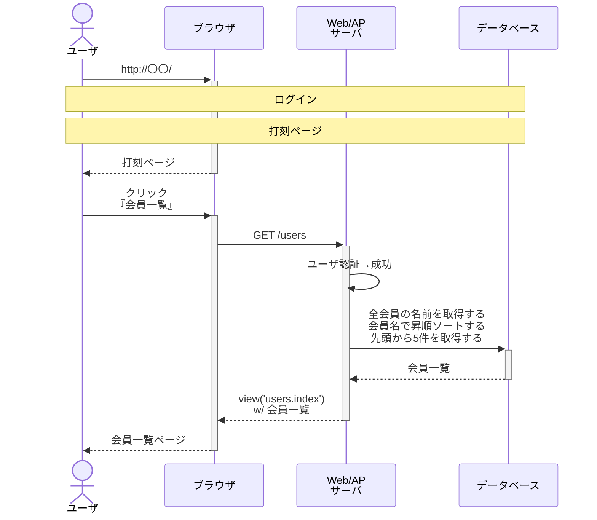
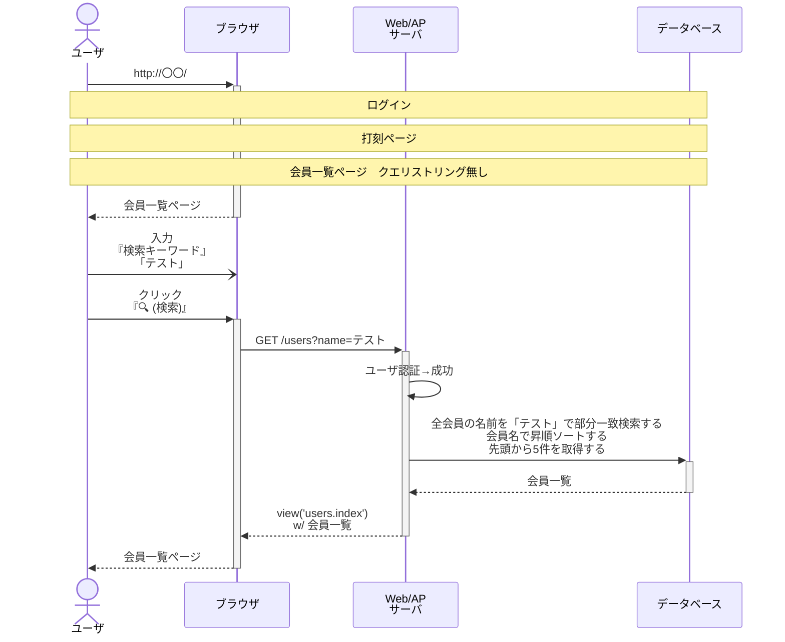

# 会員一覧ページ

## クエリストリング無し

```mermaid
sequenceDiagram
  actor U as ユーザ
  participant B as ブラウザ
  participant A as Web/AP<br>サーバ
  participant D as データベース

  U ->>+ B : http://〇〇/
  note over U, D : ログイン
  note over U, D : 打刻ページ
  B -->>- U : 打刻ページ

  U ->>+ B : クリック<br>『会員一覧』
  B ->>+ A : GET /users
  A ->> A : ユーザ認証→成功
  A ->>+ D : 全会員の名前を取得する<br>会員名で昇順ソートする<br>先頭から5件を取得する
  D -->>- A : 会員一覧
  A -->>- B : view('users.index')<br>w/ 会員一覧
  B -->>- U : 会員一覧ページ
```

## クエリストリング有り

```mermaid
sequenceDiagram
  actor U as ユーザ
  participant B as ブラウザ
  participant A as Web/AP<br>サーバ
  participant D as データベース

  U ->>+ B : http://〇〇/
  note over U, D : ログイン
  note over U, D : 打刻ページ
  note over U, D : 会員一覧ページ　クエリストリング無し
  B -->>- U : 会員一覧ページ

  U -) B : 入力<br>『検索キーワード』<br>「テスト」
  U ->>+ B : クリック<br>『🔍 (検索)』
  B ->>+ A : GET /users?name=テスト
  A ->> A : ユーザ認証→成功
  A ->>+ D : 全会員の名前を「テスト」で部分一致検索する<br>会員名で昇順ソートする<br>先頭から5件を取得する
  D -->>- A : 会員一覧
  A -->>- B : view('users.index')<br>w/ 会員一覧
  B -->>- U : 会員一覧ページ
```
