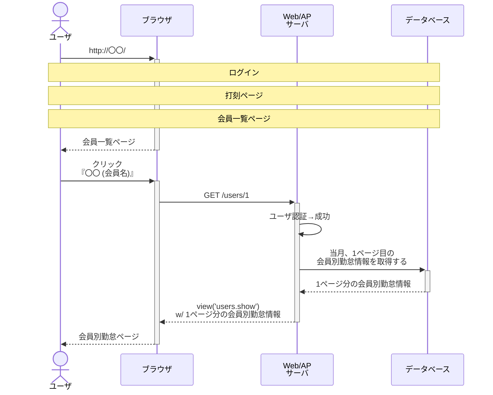
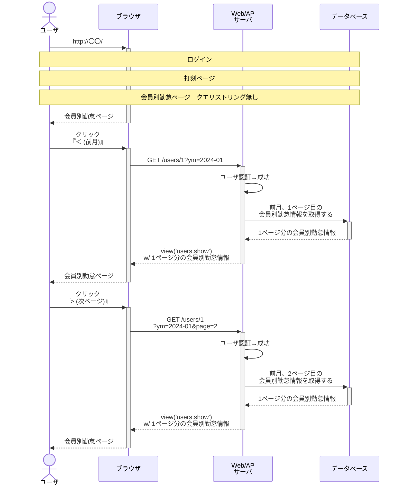

# 会員別勤怠ページ

## クエリストリング無し

```mermaid
sequenceDiagram
  actor U as ユーザ
  participant B as ブラウザ
  participant A as Web/AP<br>サーバ
  participant D as データベース

  U ->>+ B : http://〇〇/
  note over U, D : ログイン
  note over U, D : 打刻ページ
  note over U, D : 会員一覧ページ
  B -->>- U : 会員一覧ページ

  U ->>+ B : クリック<br>『〇〇 (会員名)』
  B ->>+ A : GET /users/1
  A ->> A : ユーザ認証→成功
  A ->>+ D : 当月、1ページ目の<br>会員別勤怠情報を取得する
  D -->>- A : 1ページ分の会員別勤怠情報
  A -->>- B : view('users.show')<br>w/ 1ページ分の会員別勤怠情報
  B -->>- U : 会員別勤怠ページ
```

## クエリストリング有り

```mermaid
sequenceDiagram
  actor U as ユーザ
  participant B as ブラウザ
  participant A as Web/AP<br>サーバ
  participant D as データベース

  U ->>+ B : http://〇〇/
  note over U, D : ログイン
  note over U, D : 打刻ページ
  note over U, D : 会員別勤怠ページ　クエリストリング無し
  B -->>- U : 会員別勤怠ページ

  U ->>+ B : クリック<br>『＜ (前月)』
  B ->>+ A : GET /users/1?ym=2024-01
  A ->> A : ユーザ認証→成功
  A ->>+ D : 前月、1ページ目の<br>会員別勤怠情報を取得する
  D -->>- A : 1ページ分の会員別勤怠情報
  A -->>- B : view('users.show')<br>w/ 1ページ分の会員別勤怠情報
  B -->>- U : 会員別勤怠ページ

  U ->>+ B : クリック<br>『> (次ページ)』
  B ->>+ A : GET /users/1<br>?ym=2024-01&page=2
  A ->> A : ユーザ認証→成功
  A ->>+ D : 前月、2ページ目の<br>会員別勤怠情報を取得する
  D -->>- A : 1ページ分の会員別勤怠情報
  A -->>- B : view('users.show')<br>w/ 1ページ分の会員別勤怠情報
  B -->>- U : 会員別勤怠ページ
```
