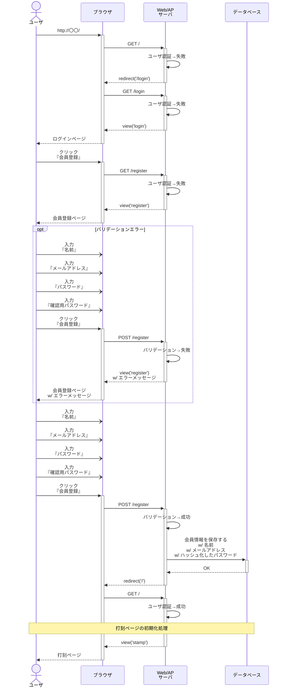

# 会員登録

```mermaid
sequenceDiagram
  actor U as ユーザ
  participant B as ブラウザ
  participant A as Web/AP<br>サーバ
  participant D as データベース

  U ->>+ B : http://〇〇/
  B ->>+ A : GET /
  A ->> A : ユーザ認証→失敗
  A -->>- B : redirect('/login')
  B ->>+ A : GET /login
  A ->> A : ユーザ認証→失敗
  A -->>- B : view('login')
  B -->>- U : ログインページ

  U ->>+ B : クリック<br>『会員登録』
  B ->>+ A : GET /register
  A ->> A : ユーザ認証→失敗
  A -->>- B : view('register')
  B -->>- U : 会員登録ページ

  opt バリデーションエラー
    U -) B : 入力<br>『名前』
    U -) B : 入力<br>『メールアドレス』
    U -) B : 入力<br>『パスワード』
    U -) B : 入力<br>『確認用パスワード』
    U ->>+ B : クリック<br>『会員登録』
    B ->>+ A : POST /register
    A ->> A : バリデーション→失敗
    A -->>- B : view('register')<br>w/ エラーメッセージ
    B -->>- U : 会員登録ページ<br>w/ エラーメッセージ
  end

  U -) B : 入力<br>『名前』
  U -) B : 入力<br>『メールアドレス』
  U -) B : 入力<br>『パスワード』
  U -) B : 入力<br>『確認用パスワード』
  U ->>+ B : クリック<br>『会員登録』
  B ->>+ A : POST /register
  A ->> A : バリデーション→成功
  A ->>+ D : 会員情報を保存する<br>w/ 名前<br>w/ メールアドレス<br>w/ ハッシュ化したパスワード
  D -->>- A : OK
  A -->>- B : redirect('/')
  B ->>+ A : GET /
  A ->> A : ユーザ認証→成功
  note over U, D : 打刻ページの初期化処理
  A -->>- B : view('stamp')
  B -->>- U : 打刻ページ
```
