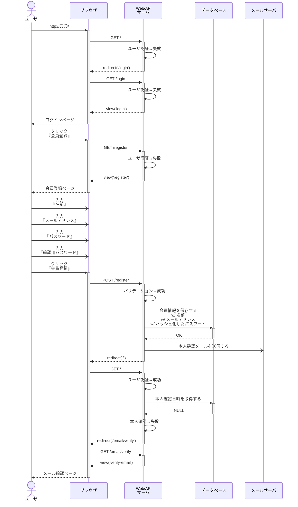
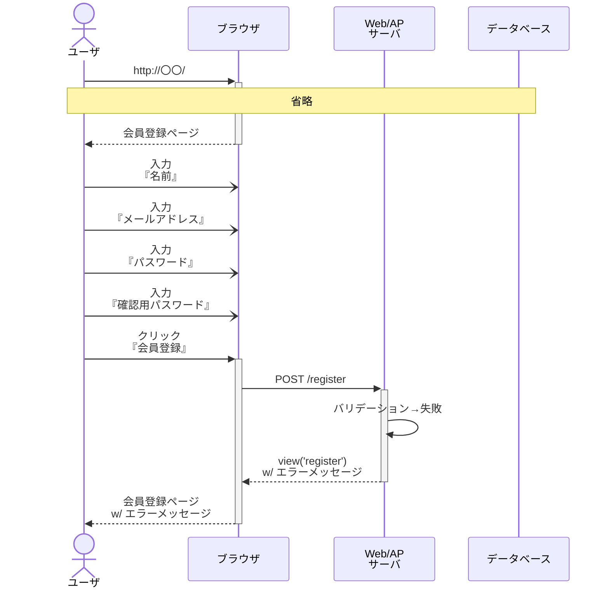
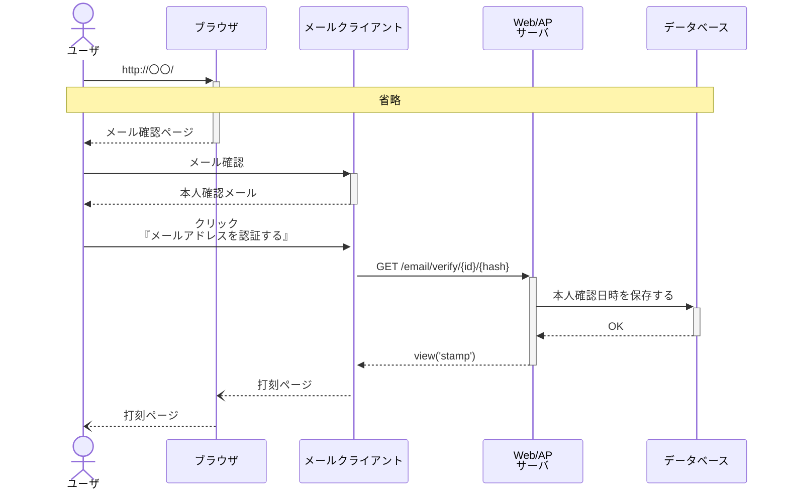
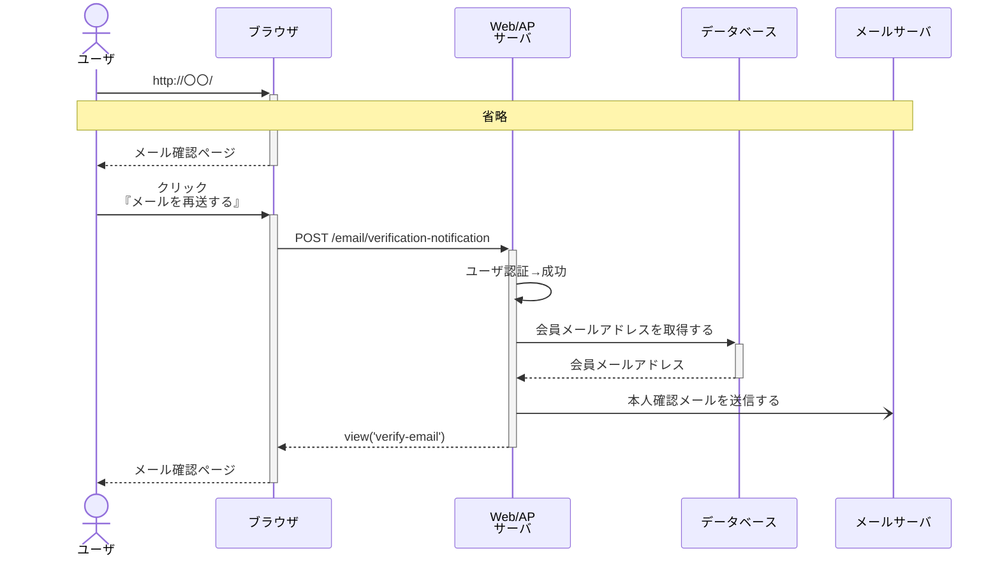

# 会員登録

## 会員登録ページ

```mermaid
sequenceDiagram
  actor U as ユーザ
  participant B as ブラウザ
  participant A as Web/AP<br>サーバ
  participant D as データベース
  participant M as メールサーバ

  U ->>+ B : http://〇〇/
  B ->>+ A : GET /
  A ->> A : ユーザ認証→失敗
  A -->>- B : redirect('/login')
  B ->>+ A : GET /login
  A ->> A : ユーザ認証→失敗
  A -->>- B : view('login')
  B -->>- U : ログインページ

  U ->>+ B : クリック<br>『会員登録』
  B ->>+ A : GET /register
  A ->> A : ユーザ認証→失敗
  A -->>- B : view('register')
  B -->>- U : 会員登録ページ

  U -) B : 入力<br>『名前』
  U -) B : 入力<br>『メールアドレス』
  U -) B : 入力<br>『パスワード』
  U -) B : 入力<br>『確認用パスワード』
  U ->>+ B : クリック<br>『会員登録』
  B ->>+ A : POST /register
  A ->> A : バリデーション→成功
  A ->>+ D : 会員情報を保存する<br>w/ 名前<br>w/ メールアドレス<br>w/ ハッシュ化したパスワード
  D -->>- A : OK
  A -) M : 本人確認メールを送信する
  A -->>- B : redirect('/')
  B ->>+ A : GET /
  A ->> A : ユーザ認証→成功
  A ->>+ D : 本人確認日時を取得する
  D -->>- A : NULL
  A ->> A : 本人確認→失敗
  A -->>- B : redirect('/email/verify')
  B ->>+ A : GET /email/verify
  A -->>- B : view('verify-email')
  B -->>- U : メール確認ページ
```

## 会員登録ページ（バリデーションエラー時）

```mermaid
sequenceDiagram
  actor U as ユーザ
  participant B as ブラウザ
  participant A as Web/AP<br>サーバ
  participant D as データベース

  U ->>+ B : http://〇〇/
  note over U, D : 省略
  B -->>- U : 会員登録ページ

  U -) B : 入力<br>『名前』
  U -) B : 入力<br>『メールアドレス』
  U -) B : 入力<br>『パスワード』
  U -) B : 入力<br>『確認用パスワード』
  U ->>+ B : クリック<br>『会員登録』
  B ->>+ A : POST /register
  A ->> A : バリデーション→失敗
  A -->>- B : view('register')<br>w/ エラーメッセージ
  B -->>- U : 会員登録ページ<br>w/ エラーメッセージ
```

## メールによる本人確認

```mermaid
sequenceDiagram
  actor U as ユーザ
  participant B as ブラウザ
  participant M as メールクライアント
  participant A as Web/AP<br>サーバ
  participant D as データベース

  U ->>+ B : http://〇〇/
  note over U, D : 省略
  B -->>- U : メール確認ページ

  U ->>+ M : メール確認
  M -->>- U : 本人確認メール
  U ->>+ M : クリック<br>『メールアドレスを認証する』
  M ->>+ A : GET /email/verify/{id}/{hash}
  A ->>+ D : 本人確認日時を保存する
  D -->>- A : OK
  A -->>- M : view('stamp')
  M --) B : 打刻ページ
  B --) U : 打刻ページ
```

## メール再送

```mermaid
sequenceDiagram
  actor U as ユーザ
  participant B as ブラウザ
  participant A as Web/AP<br>サーバ
  participant D as データベース
  participant M as メールサーバ

  U ->>+ B : http://〇〇/
  note over U, M : 省略
  B -->>- U : メール確認ページ

  U ->>+ B : クリック<br>『メールを再送する』
  B ->>+ A : POST /email/verification-notification
  A ->> A : ユーザ認証→成功
  A ->>+ D : 会員メールアドレスを取得する
  D -->>- A : 会員メールアドレス
  A -) M : 本人確認メールを送信する
  A -->>- B : view('verify-email')
  B -->>- U : メール確認ページ
```
