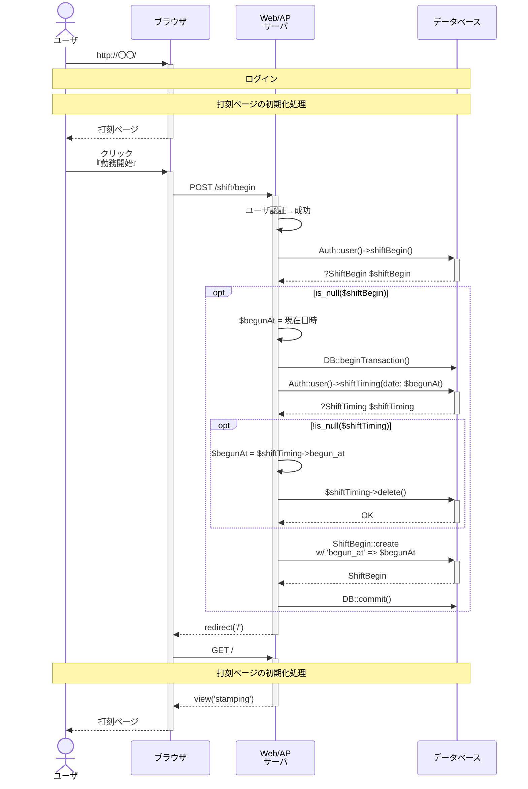

# 勤務開始

```mermaid
sequenceDiagram
  actor U as ユーザ
  participant B as ブラウザ
  participant A as Web/AP<br>サーバ
  participant D as データベース

  U ->>+ B : http://〇〇/
  note over U, D : ログイン
  note over U, D : 打刻ページの初期化処理
  B -->>- U : 打刻ページ
  U ->>+ B : クリック<br>『勤務開始』
  B ->>+ A : POST /shift/begin
  A ->> A : ユーザ認証→成功

  A ->>+ D : Auth::user()->shiftBegin()
  D -->>- A : ?ShiftBegin $shiftBegin
  opt is_null($shiftBegin)
    A ->> A : $begunAt = 現在日時
    A ->> D : DB::beginTransaction()
    A ->>+ D : Auth::user()->shiftTiming(date: $begunAt)
    D -->>- A : ?ShiftTiming $shiftTiming
    opt !is_null($shiftTiming)
      A ->> A : $begunAt = $shiftTiming->begun_at
      A ->>+ D : $shiftTiming->delete()
      D -->>- A : OK
    end
    A ->>+ D : ShiftBegin::create<br>w/ 'begun_at' => $begunAt
    D -->>- A : ShiftBegin
    A ->> D : DB::commit()
  end

  A -->>- B : redirect('/')
  B ->>+ A : GET /
  note over U, D : 打刻ページの初期化処理
  A -->>- B : view('stamping')
  B -->>- U : 打刻ページ
```
