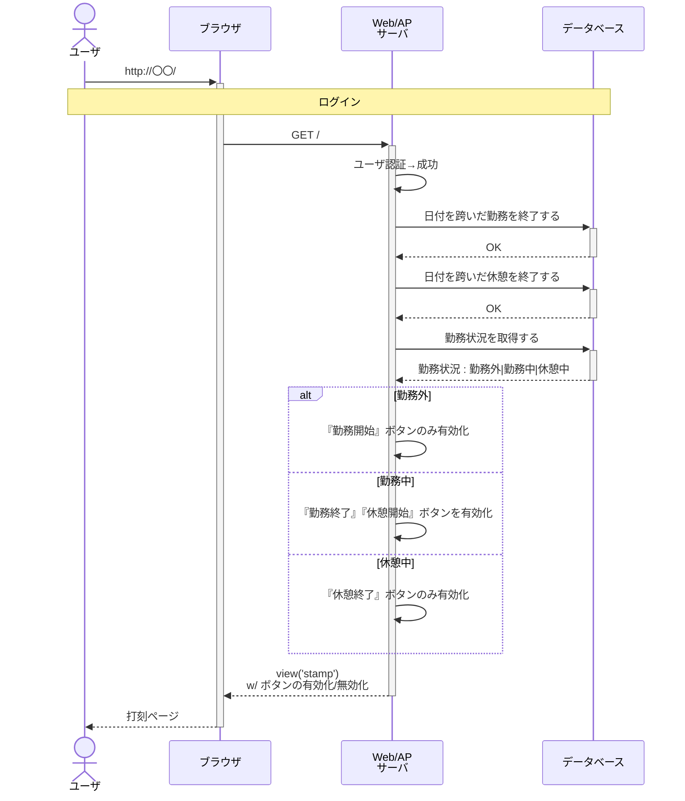
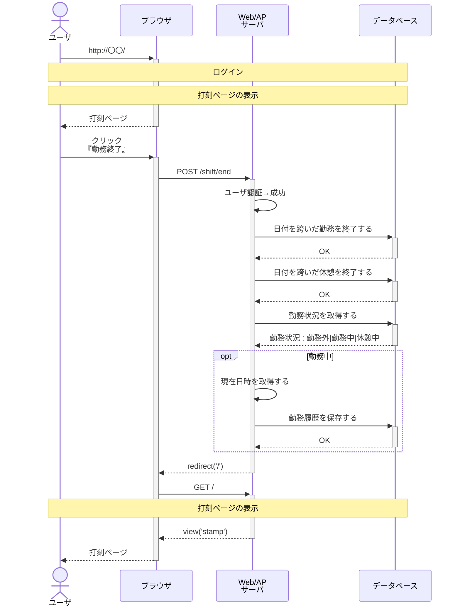
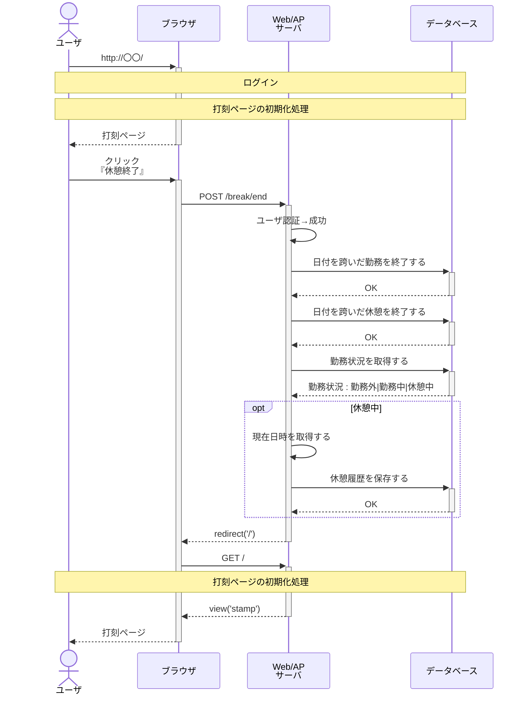

# 打刻ページ

## 打刻ページの表示

```mermaid
sequenceDiagram
  actor U as ユーザ
  participant B as ブラウザ
  participant A as Web/AP<br>サーバ
  participant D as データベース

  U ->>+ B : http://〇〇/
  note over U, D : ログイン
  B ->>+ A : GET /
  A ->> A : ユーザ認証→成功

  A ->>+ D : 日付を跨いだ勤務を終了する
  D -->>- A : OK

  A ->>+ D : 日付を跨いだ休憩を終了する
  D -->>- A : OK

  A ->>+ D : 勤務状況を取得する
  D -->>- A : 勤務状況 : 勤務外|勤務中|休憩中

  alt 勤務外
    A ->> A : 『勤務開始』ボタンのみ有効化
  else 勤務中
    A ->> A : 『勤務終了』『休憩開始』ボタンを有効化
  else 休憩中
    A ->> A : 『休憩終了』ボタンのみ有効化
  end

  A -->>- B : view('stamp')<br>w/ ボタンの有効化/無効化
  B -->>- U : 打刻ページ
```

## 勤務開始

```mermaid
sequenceDiagram
  actor U as ユーザ
  participant B as ブラウザ
  participant A as Web/AP<br>サーバ
  participant D as データベース

  U ->>+ B : http://〇〇/
  note over U, D : ログイン
  note over U, D : 打刻ページの表示
  B -->>- U : 打刻ページ
  U ->>+ B : クリック<br>『勤務開始』
  B ->>+ A : POST /shift/begin
  A ->> A : ユーザ認証→成功

  A ->>+ D : 日付を跨いだ勤務を終了する
  D -->>- A : OK

  A ->>+ D : 日付を跨いだ休憩を終了する
  D -->>- A : OK

  A ->>+ D : 勤務状況を取得する
  D -->>- A : 勤務状況 : 勤務外|勤務中|休憩中

  opt 勤務外
    A ->> A : 現在日時を取得する
    A ->>+ D : 勤務開始日時を保存する
    D -->>- A : OK
  end

  A -->>- B : redirect('/')
  B ->>+ A : GET /
  note over U, D : 打刻ページの表示
  A -->>- B : view('stamp')
  B -->>- U : 打刻ページ
```

## 勤務終了

```mermaid
sequenceDiagram
  actor U as ユーザ
  participant B as ブラウザ
  participant A as Web/AP<br>サーバ
  participant D as データベース

  U ->>+ B : http://〇〇/
  note over U, D : ログイン
  note over U, D : 打刻ページの表示
  B -->>- U : 打刻ページ

  U ->>+ B : クリック<br>『勤務終了』
  B ->>+ A : POST /shift/end
  A ->> A : ユーザ認証→成功

  A ->>+ D : 日付を跨いだ勤務を終了する
  D -->>- A : OK

  A ->>+ D : 日付を跨いだ休憩を終了する
  D -->>- A : OK

  A ->>+ D : 勤務状況を取得する
  D -->>- A : 勤務状況 : 勤務外|勤務中|休憩中

  opt 勤務中
    A ->> A : 現在日時を取得する
    A ->>+ D : 勤務履歴を保存する
    D -->>- A : OK
  end

  A -->>- B : redirect('/')
  B ->>+ A : GET /
  note over U, D : 打刻ページの表示
  A -->>- B : view('stamp')
  B -->>- U : 打刻ページ
```

## 休憩開始

```mermaid
sequenceDiagram
  actor U as ユーザ
  participant B as ブラウザ
  participant A as Web/AP<br>サーバ
  participant D as データベース

  U ->>+ B : http://〇〇/
  note over U, D : ログイン
  note over U, D : 打刻ページの初期化処理
  B -->>- U : 打刻ページ

  U ->>+ B : クリック<br>『休憩開始』
  B ->>+ A : POST /break/begin
  A ->> A : ユーザ認証→成功

  A ->>+ D : 日付を跨いだ勤務を終了する
  D -->>- A : OK

  A ->>+ D : 日付を跨いだ休憩を終了する
  D -->>- A : OK

  A ->>+ D : 勤務状況を取得する
  D -->>- A : 勤務状況 : 勤務外|勤務中|休憩中

  opt 勤務中
    A ->> A : 現在日時を取得する
    A ->>+ D : 休憩開始日時を保存する
    D -->>- A : OK
  end

  A -->>- B : redirect('/')
  B ->>+ A : GET /
  note over U, D : 打刻ページの初期化処理
  A -->>- B : view('stamp')
  B -->>- U : 打刻ページ
```

## 休憩終了

```mermaid
sequenceDiagram
  actor U as ユーザ
  participant B as ブラウザ
  participant A as Web/AP<br>サーバ
  participant D as データベース

  U ->>+ B : http://〇〇/
  note over U, D : ログイン
  note over U, D : 打刻ページの初期化処理
  B -->>- U : 打刻ページ

  U ->>+ B : クリック<br>『休憩終了』
  B ->>+ A : POST /break/end
  A ->> A : ユーザ認証→成功

  A ->>+ D : 日付を跨いだ勤務を終了する
  D -->>- A : OK

  A ->>+ D : 日付を跨いだ休憩を終了する
  D -->>- A : OK

  A ->>+ D : 勤務状況を取得する
  D -->>- A : 勤務状況 : 勤務外|勤務中|休憩中

  opt 休憩中
    A ->> A : 現在日時を取得する
    A ->>+ D : 休憩履歴を保存する
    D -->>- A : OK
  end

  A -->>- B : redirect('/')
  B ->>+ A : GET /
  note over U, D : 打刻ページの初期化処理
  A -->>- B : view('stamp')
  B -->>- U : 打刻ページ
```
