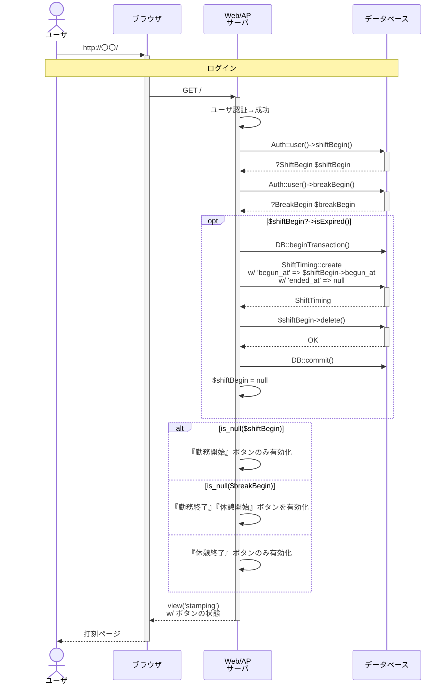

# 打刻ページの初期化処理

```mermaid
sequenceDiagram
  actor U as ユーザ
  participant B as ブラウザ
  participant A as Web/AP<br>サーバ
  participant D as データベース

  U ->>+ B : http://〇〇/
  note over U, D : ログイン
  B ->>+ A : GET /
  A ->> A : ユーザ認証→成功

  A ->>+ D : Auth::user()->shiftBegin()
  D -->>- A : ?ShiftBegin $shiftBegin
  A ->>+ D : Auth::user()->breakBegin()
  D -->>- A : ?BreakBegin $breakBegin

  opt $shiftBegin?->isExpired()
    A ->> D : DB::beginTransaction()
    A ->>+ D : ShiftTiming::create<br>w/ 'begun_at' => $shiftBegin->begun_at<br>w/ 'ended_at' => null
    D -->>- A : ShiftTiming
    A ->>+ D : $shiftBegin->delete()
    D -->>- A : OK
    A ->> D : DB::commit()
    A ->> A : $shiftBegin = null
  end

  alt is_null($shiftBegin)
    A ->> A : 『勤務開始』ボタンのみ有効化
  else is_null($breakBegin)
    A ->> A : 『勤務終了』『休憩開始』ボタンを有効化
  else
    A ->> A : 『休憩終了』ボタンのみ有効化
  end
  A -->>- B : view('stamping')<br>w/ ボタンの状態
  B -->>- U : 打刻ページ
```
