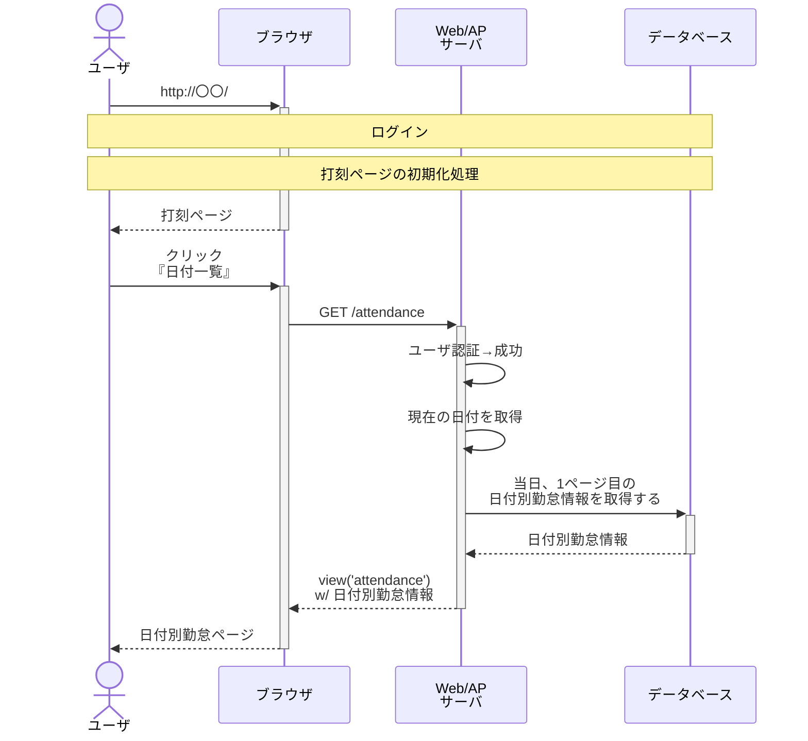
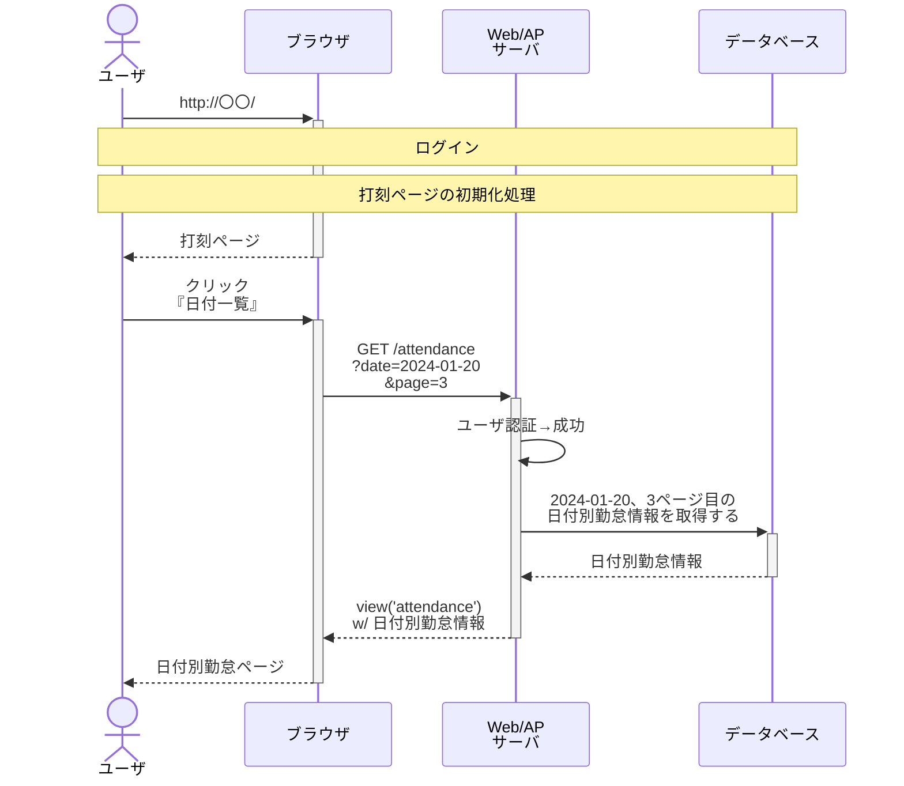

# 日付別勤怠ページ

## クエリストリング無し

```mermaid
sequenceDiagram
  actor U as ユーザ
  participant B as ブラウザ
  participant A as Web/AP<br>サーバ
  participant D as データベース

  U ->>+ B : http://〇〇/
  note over U, D : ログイン
  note over U, D : 打刻ページの初期化処理
  B -->>- U : 打刻ページ

  U ->>+ B : クリック<br>『日付一覧』
  B ->>+ A : GET /attendance
  A ->> A : ユーザ認証→成功
  A ->> A : 現在の日付を取得
  A ->>+ D : 当日、1ページ目の<br>日付別勤怠情報を取得する
  D -->>- A : 日付別勤怠情報
  A -->>- B : view('attendance')<br>w/ 日付別勤怠情報
  B -->>- U : 日付別勤怠ページ
```

## クエリストリング有り

```mermaid
sequenceDiagram
  actor U as ユーザ
  participant B as ブラウザ
  participant A as Web/AP<br>サーバ
  participant D as データベース

  U ->>+ B : http://〇〇/
  note over U, D : ログイン
  note over U, D : 打刻ページの初期化処理
  B -->>- U : 打刻ページ

  U ->>+ B : クリック<br>『日付一覧』
  B ->>+ A : GET /attendance<br>?date=2024-01-20<br>&page=3
  A ->> A : ユーザ認証→成功
  A ->>+ D : 2024-01-20、3ページ目の<br>日付別勤怠情報を取得する
  D -->>- A : 日付別勤怠情報
  A -->>- B : view('attendance')<br>w/ 日付別勤怠情報
  B -->>- U : 日付別勤怠ページ
```
