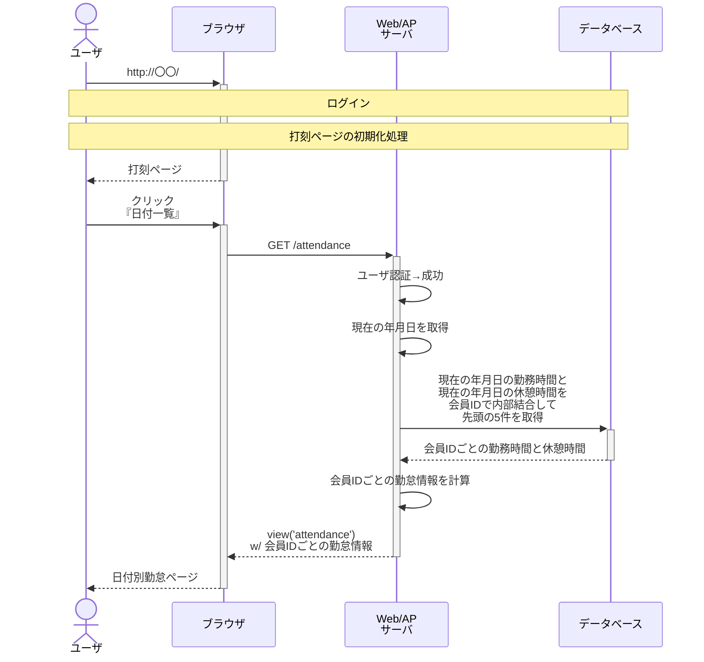
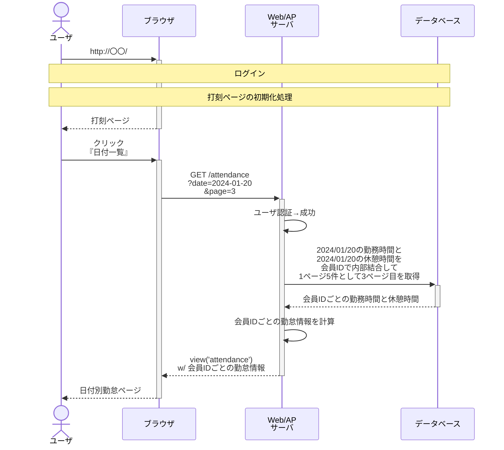

# 日付別勤怠ページ

## クエリストリング無し

## クエリストリング有り

## 会員IDごとの勤怠情報

- 勤務開始時刻 = shift_timings.begun_atの時分秒
- 勤務終了時刻 = shift_timings.ended_atの時分秒（nullの場合は「記録がありません」）

### 合計休憩時間

- break_timingsのレコードは年月日を指定して取得している。
- break_timings.user_idでグループ化する
- 各グループのbegun_atとended_atの時間間隔を合計する
- 例外1: ended_atがnullのレコードが存在する場合は「記録がありません」と表示する
- 例外2: 同じuser_idと年月日のbreak_beginsレコードが存在する場合は「記録がありません」と表示する

### 労働時間

- shift_timingsは年月日を指定して取得している
- 仕様上shift_timings.user_idにつき0~1件になるはず。
- user_id別で「begun_atとended_atの時間間隔 - 同じuser_idの合計休憩時間」を計算する
- 例外1: ended_atがnullの場合は「記録がありません」と表示する
- 例外2: 合計休憩時間が「記録がありません」の場合は労働時間も「記録がありません」と表示する
