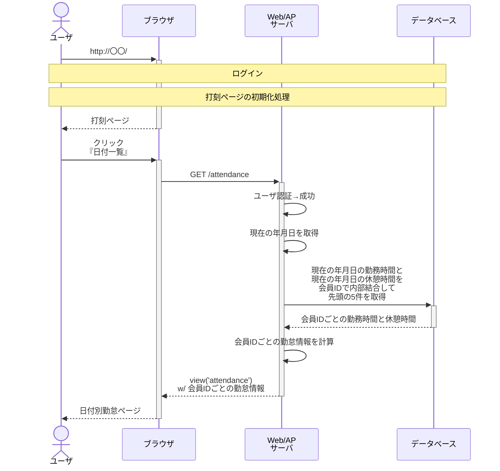
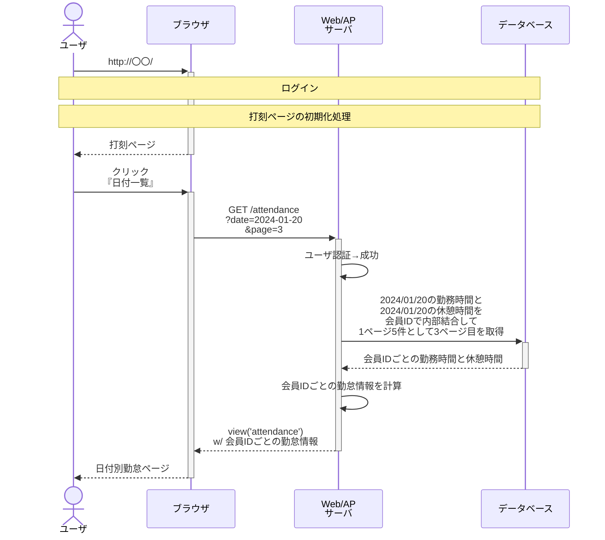

# 日付別勤怠ページ

## クエリストリング無し

### 会員IDごとの勤怠情報

- 勤務開始時刻 = shift_timings.begun_atの時分秒
- 勤務終了時刻 = shift_timings.ended_atの時分秒（nullの場合は「記録がありません」）
- 合計休憩時間 = break_timings.begun_atとbreak_timings.ended_atの時間間隔
- 労働時間 = shift_timings.begun_atとshift_timings.ended_atの時間間隔 - 合計休憩時間

## クエリストリング有り

