<!-- omit in toc -->
# 画面遷移図

<!-- omit in toc -->
## 画面遷移一覧

- [認証ページ](#認証ページ)
  - [認証ページ間の遷移](#認証ページ間の遷移)
  - [会員登録時の遷移](#会員登録時の遷移)
  - [メール確認ページ](#メール確認ページ)
  - [メールによる本人確認](#メールによる本人確認)
  - [ログイン時の遷移](#ログイン時の遷移)
- [打刻ページ](#打刻ページ)
  - [認証ページ/日付別勤怠ページからの遷移](#認証ページ日付別勤怠ページからの遷移)
  - [勤務開始ボタン押下時の遷移](#勤務開始ボタン押下時の遷移)
  - [勤務終了ボタン押下時の遷移](#勤務終了ボタン押下時の遷移)
  - [休憩開始ボタン押下時の遷移](#休憩開始ボタン押下時の遷移)
  - [休憩終了ボタン押下時の遷移](#休憩終了ボタン押下時の遷移)
- [日付別勤怠ページ](#日付別勤怠ページ)
  - [打刻ページからの遷移](#打刻ページからの遷移)
  - [前ページリンク押下時の遷移](#前ページリンク押下時の遷移)
  - [次ページリンク押下時の遷移](#次ページリンク押下時の遷移)
  - [前日リンク押下時の遷移](#前日リンク押下時の遷移)
  - [翌日リンク押下時の遷移](#翌日リンク押下時の遷移)
  - [ページリンク押下時の遷移](#ページリンク押下時の遷移)
- [会員一覧ページ](#会員一覧ページ)
  - [他ページから会員一覧ページへの遷移](#他ページから会員一覧ページへの遷移)
  - [会員一覧ページでのキーワード検索](#会員一覧ページでのキーワード検索)
  - [会員一覧ページのページネーション](#会員一覧ページのページネーション)
- [会員別勤怠ページ](#会員別勤怠ページ)
  - [他ページから会員別勤怠ページへの遷移](#他ページから会員別勤怠ページへの遷移)
  - [会員別勤怠ページでのページネーション](#会員別勤怠ページでのページネーション)
  - [会員別勤怠ページでの月の移動](#会員別勤怠ページでの月の移動)

## 認証ページ

### 認証ページ間の遷移


### 会員登録時の遷移


- [会員登録する](ワークセット.md#会員登録する)
- [本人確認メールを送信する](ワークセット.md#本人確認メールを送信する)

### メール確認ページ


- [本人確認メールを送信する](ワークセット.md#本人確認メールを送信する)

### メールによる本人確認


- [メールアドレスを確認する](ワークセット.md#メールアドレスを確認する)

### ログイン時の遷移


- [ログイン認証する](ワークセット.md#ログイン認証する)

## 打刻ページ

### 認証ページ/日付別勤怠ページからの遷移


- [日付を跨いだ勤務/休憩を終了する](ワークセット.md#日付を跨いだ勤務休憩を終了する)
- [勤務状況からボタンの有効化/無効化を判定する](ワークセット.md#勤務状況からボタンの有効化無効化を判定する)

### 勤務開始ボタン押下時の遷移


- [勤務を開始する](ワークセット.md#勤務を開始する)
- [日付を跨いだ勤務/休憩を終了する](ワークセット.md#日付を跨いだ勤務休憩を終了する)

### 勤務終了ボタン押下時の遷移


- [勤務を終了する](ワークセット.md#勤務を終了する)
- [日付を跨いだ勤務/休憩を終了する](ワークセット.md#日付を跨いだ勤務休憩を終了する)

### 休憩開始ボタン押下時の遷移

- [休憩を開始する](ワークセット.md#休憩を開始する)
- [日付を跨いだ勤務/休憩を終了する](ワークセット.md#日付を跨いだ勤務休憩を終了する)

### 休憩終了ボタン押下時の遷移


- [休憩を終了する](ワークセット.md#休憩を終了する)
- [日付を跨いだ勤務/休憩を終了する](ワークセット.md#日付を跨いだ勤務休憩を終了する)

## 日付別勤怠ページ

### 打刻ページからの遷移


- [当日、1ページ目の日付別勤怠情報を表示する](ワークセット.md#当日1ページ目の日付別勤怠情報を表示する)

### 前ページリンク押下時の遷移


- [当日、前ページの日付別勤怠情報を表示する](ワークセット.md#当日前ページの日付別勤怠情報を表示する)

### 次ページリンク押下時の遷移


- [当日、次ページの日付別勤怠情報を表示する](ワークセット.md#当日次ページの日付別勤怠情報を表示する)

### 前日リンク押下時の遷移


- [前日、1ページ目の日付別勤怠情報を表示する](ワークセット.md#前日1ページ目の日付別勤怠情報を表示する)

### 翌日リンク押下時の遷移


- [翌日、1ページ目の日付別勤怠情報を表示する](ワークセット.md#翌日1ページ目の日付別勤怠情報を表示する)

### ページリンク押下時の遷移


- [同日、Nページ目の日付別勤怠情報を表示する](ワークセット.md#同日nページ目の日付別勤怠情報を表示する)

## 会員一覧ページ

### 他ページから会員一覧ページへの遷移


- [検索キーワードを指定せずに会員一覧を表示する](ワークセット.md#検索キーワードを指定せずに会員一覧を表示する)

### 会員一覧ページでのキーワード検索


- [検索キーワードを指定して会員一覧を表示する](ワークセット.md#検索キーワードを指定して会員一覧を表示する)

### 会員一覧ページのページネーション


- [検索キーワードとページ番号を指定して会員一覧を表示する](ワークセット.md#検索キーワードとページ番号を指定して会員一覧を表示する)

## 会員別勤怠ページ

### 他ページから会員別勤怠ページへの遷移

### 会員別勤怠ページでのページネーション

### 会員別勤怠ページでの月の移動
