<!-- omit in toc -->
# 画面遷移図

<!-- omit in toc -->
## 画面遷移一覧

- [認証ページ](#認証ページ)
  - [認証ページ間の遷移](#認証ページ間の遷移)
  - [会員登録時の遷移](#会員登録時の遷移)
  - [ログイン時の遷移](#ログイン時の遷移)
- [打刻ページ](#打刻ページ)
  - [認証ページからの遷移](#認証ページからの遷移)
  - [勤務開始ボタン押下時の遷移](#勤務開始ボタン押下時の遷移)
  - [勤務終了ボタン押下時の遷移](#勤務終了ボタン押下時の遷移)
  - [休憩開始ボタン押下時の遷移](#休憩開始ボタン押下時の遷移)
  - [休憩終了ボタン押下時の遷移](#休憩終了ボタン押下時の遷移)
- [日付別勤怠ページ](#日付別勤怠ページ)
  - [打刻ページからの遷移](#打刻ページからの遷移)
  - [前ページボタン押下時の遷移](#前ページボタン押下時の遷移)
  - [次ページボタン押下時の遷移](#次ページボタン押下時の遷移)
  - [前日ボタン押下時の遷移](#前日ボタン押下時の遷移)
  - [翌日ボタン押下時の遷移](#翌日ボタン押下時の遷移)

## 認証ページ

### 認証ページ間の遷移

### 会員登録時の遷移

- [登録バリデーション](ワークセット.md#登録バリデーション)
- [会員登録処理](ワークセット.md#会員登録処理)

### ログイン時の遷移

- [ログインバリデーション](ワークセット.md#ログインバリデーション)
- [ログイン処理](ワークセット.md#ログイン処理)

## 打刻ページ

### 認証ページからの遷移

- [打刻ページの初期化処理](ワークセット.md#打刻ページの初期化処理)
- [勤務終了処理](ワークセット.md#勤務終了処理)

### 勤務開始ボタン押下時の遷移

- [勤務開始処理](ワークセット.md#勤務開始処理)
- [打刻ページの初期化処理](ワークセット.md#打刻ページの初期化処理)

### 勤務終了ボタン押下時の遷移

- [勤務終了処理](ワークセット.md#勤務終了処理)
- [打刻ページの初期化処理](ワークセット.md#打刻ページの初期化処理)

### 休憩開始ボタン押下時の遷移

- [休憩開始処理](ワークセット.md#休憩開始処理)
- [打刻ページの初期化処理](ワークセット.md#打刻ページの初期化処理)

### 休憩終了ボタン押下時の遷移

- [休憩終了処理](ワークセット.md#休憩終了処理)
- [打刻ページの初期化処理](ワークセット.md#打刻ページの初期化処理)

## 日付別勤怠ページ

### 打刻ページからの遷移

- [当日の日付別勤怠情報取得](ワークセット.md#当日の日付別勤怠情報取得)

### 前ページボタン押下時の遷移

- [前ページの日付別勤怠情報取得](ワークセット.md#前ページの日付別勤怠情報取得)

### 次ページボタン押下時の遷移

- [次ページの日付別勤怠情報取得](ワークセット.md#次ページの日付別勤怠情報取得)

### 前日ボタン押下時の遷移

- [前日の日付別勤怠情報取得](ワークセット.md#前日の日付別勤怠情報取得)

### 翌日ボタン押下時の遷移

- [翌日の日付別勤怠情報取得](ワークセット.md#翌日の日付別勤怠情報取得)
