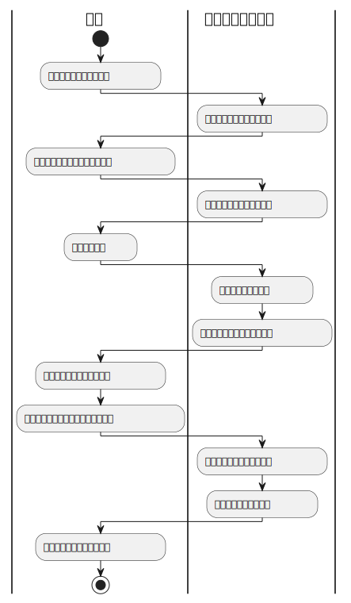

<!-- omit in toc -->
# 行動シナリオ

<!-- omit in toc -->
## 行動シナリオ一覧

- [会員登録](#会員登録)
- [勤務開始](#勤務開始)
- [勤務終了](#勤務終了)
- [休憩開始](#休憩開始)
- [休憩終了](#休憩終了)
- [人事評価](#人事評価)

## 会員登録

## 勤務開始

## 勤務終了

## 休憩開始

## 休憩終了

## 人事評価

